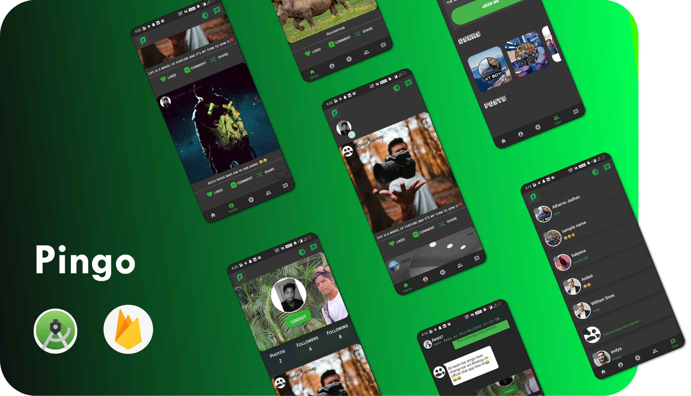

# Pingo    Social Media App    

### Developed by 
### AKSHAY JADHAV                                     
----------------------------------------------------------------------------------------------------------------------------------
## App Features

### 1 - Create Account With Google or Firebase Auth
### 2 - Edit Profile Image And Cover 
### 3 - Upload Post (With Image Without Image)
### 4 - User Can Edit Post After Posting (also can change image)  
### 5 - Follow Other User 
### 6 - Chat System 
### 7 - User Can Share Post On Different  Platform 
### 8 - Password Encrypted With Firebase
### 9 - Simple Swipe Follow Option
### 10 - Recent Chat (user can view his recent chats).
### And many more......

## Working ScreenShot

### Home Screen & Loading Screen
------

### Profile Screen
------

# Database 

# ABSTRACT 
Lorem Ipsum is simply dummy text of the printing and typesetting industry. Lorem Ipsum has been the industry's standard dummy text ever since the 1500s, when an unknown printer took a galley of type and scrambled it to make a type specimen book. It has survived not only five centuries, but also the leap into electronic typesetting, remaining essentially unchanged. It was popularised in the 1960s with the release of Letraset sheets containing Lorem Ipsum passages, and more recently with desktop publishing software like Aldus PageMaker including versions of Lorem Ipsum. receivers. 

### Importance of the Project: -
Lorem Ipsum is simply dummy text of the printing and typesetting industry. Lorem Ipsum has been the industry's standard dummy text ever since the 1500s, when an unknown printer took a galley of type and scrambled it to make a type specimen book. It has survived not only five centuries, but also the leap into electronic typesetting, remaining essentially unchanged. It was popularised in the 1960s with the release of Letraset sheets containing Lorem Ipsum passages, and more recently with desktop publishing software like Aldus PageMaker including versions of Lorem Ipsum.

## Need of this application: -
Lorem Ipsum is simply dummy text of the printing and typesetting industry. Lorem Ipsum has been the industry's standard dummy text ever since the 1500s, when an unknown printer took a galley of type and scrambled it to make a type specimen book. It has survived not only five centuries, but also the leap into electronic typesetting, remaining essentially unchanged. It was popularised in the 1960s with the release of Letraset sheets containing Lorem Ipsum passages, and more recently with desktop publishing software like Aldus PageMaker including versions of Lorem Ipsum.

